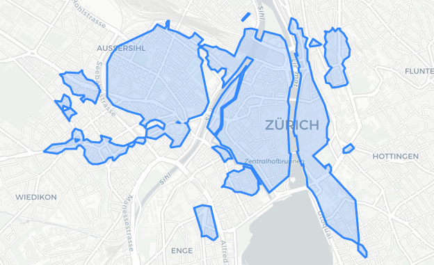

## Areas-of-Interest for and with OpenStreetMap

### About this repository

This repository contains the (minimally) maintained source code which mainly generates Areas-of-Interest (AOI) for and with OpenStreetMap. This code was initially developped in a master thesis by Koster (2018) at Geometa Lab HSR.

There are following main directories with individual READMEs:

* `notebooks/` Prototyping environment for the AOI generation process  (Jupyter).
* `webapp/` Simple web app of AOI, as well as containing an AOI polygon generator script.

The simple web app is deployed also online, but there is no warranty about the availability of it. Access can be given on demand.

This software is mainly using PostgreSQL/PostGIS (SQL) and Python, accompanied with the OSMnx library for analyzing the street network. 

### How to install

See https://github.com/geometalab/aoi-osm/blob/master/webapp/README.md

TODO. 

### About Areas-of-Interest

The objective of Areas-of-Interest (AOI) is to convey visual information to a user (map reader or tourist) where there are areas are of "high interest" regarding facilities like shopping, eating, accomodation, sightseeing or leisure.

The use of AOI comprises touristic applications as well as urban planning and location-allocation analysis and site selection.  
AOI are also used to identify completeness of OpenStreetMap (POI) data (see [wiki page about Completeness](https://wiki.openstreetmap.org/wiki/Completeness) and Clough, 2018).
The preferred spatial resolution of this dataset is between 10 and 2 meters on the ground (zoom levels from 16 to 14).

A main input of AOI are Points-of-Interest (POI). Typical POI are restaurants, bars, shops or museums. While POI are mostly punctual, the geometry of AOI is of type area or polygon. In fact, AOI can be also based on the street network and potentially on more information like human location tracks. Google introduced 2016 AOI in their map products and visualized it as orange shades. Google is reportedly using human location tracks to derive information of "high activity" but did not disclose the algorithms behind their AOI layer.

### About this approach

The goal of this project is to produce AOI with a reproducible process which is based on open data, specifically POI and pedestrian routing data from the OpenStreetMap crowdsourcing project. The AOI are defined here as 

> "Urban area at city or neighbourhood level with a high concentration of Points-of-Interests (POI) and 
> typically located along a street of high spatial importance". 

Roughly five processing steps are currently used to generate these AOI: 

1. filtering relevant POI (taking POI from OpenStreetMap as input), 
1. spatially clustering selected POI using the DBSCAN algorithm, 
1. creating areas using concave hull algorithm, 
1. extend the resulting areas with a certain spatial buffer based on a network centrality algorithm (taking routes as input), 
1. sanitizing the AOI e.g. by removing water areas and eliminating sliver polygons. 

The parameters eps and minPts of the DBSCAN algorithm have been heuristically adjusted and are calculated in a locally adapted way.

_Figure: AOI of the city center of Zurich (Switzerland)._

### References

To reference this work you can use the DOI mentioned below.

* Koster, Ph. (2018): Big Spatial Data Analysis and Processing. HSR Hochschule für Technik Rapperswil. Unpublished master's thesis. Online http://eprints.hsr.ch/672/
* Koster, Ph. (2018): Areas-of-Interest from OpenStreetMap (Switzerland). PANGAEA, https://doi.pangaea.de/10.1594/PANGAEA.892644 (DOI registration in progress).
* Keller S. (2018): "Areas-of-Interest for OpenStreetMap with Big Spatial Data Analytics". Presentation at Academic Track of State Of The Map 2018, Milano (Italy). https://2018.stateofthemap.org/2018/A30-Areas-of-Interest_for_OpenStreetMap_with_Big_Spatial_Data_Analytics_/
* Clough, J. (2018): "Can we identify 'completeness' of OpenStreetMap features from the data?" Blog post. http://sk53-osm.blogspot.com/2018/07/can-we-identify-completeness-of.html 
* "Areas-of-Interest for OpenStreetMap (AOI for OSM)", White Paper Draft v.01: https://md.coredump.ch/s/HkT2Up6Hz# (unpublished)

